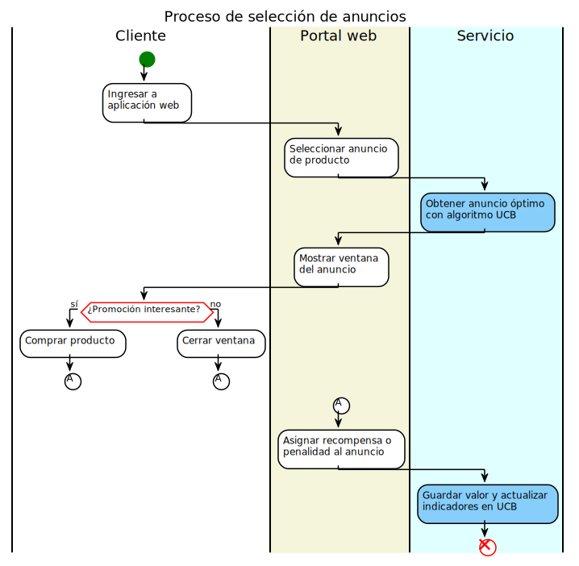
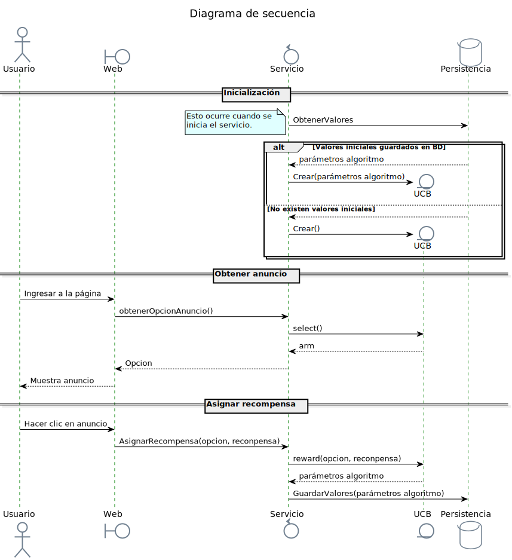

# UCB-Service
----
## Tabla de contenido
- [Descripción](#Descripción)
- [Resultados](#Resultados)
- [Diseño](#Diseño)
- [Peticiones](#Peticiones)
- [Dependencias](#Dependencias)
- [Documentación](#Documentación)

## Descripción

Servicio que emplea el algoritmo [UCB](https://github.com/kurttheviking/ucb-js) para la selección óptima de anuncios web. Esto, permite alcanzar tasas de clics superiores a una elección aleatoria. En el siguiente gráfico, se muestra como el servicio puede incrementar los clics aproximadamente al doble, en un escenario de ejemplo con 3 anuncios y 10000 visualizaciones.


Esto puede aplicarse cuando en una página web se requieren mostrar uno de tres posibles anuncios, que ofrecen de forma diferente un mismo producto o servicio, como se muestra la siguiente imagen:


Bajo este escenario el usuario o cliente toma una de las siguientes elecciones:
1. Cerrar el anuncio.
2. Comprar el producto o ingresar a la oferta.

Cada uno de los anuncios publicitarios alternativos tiene un porcentaje de efectividad intrínseco para promover la venta del producto o campaña. Pero, a priori esos valores son desconocidos, por lo que no es posible explotar el potencial del mejor de ellos. 

En las circunstancias descritas, puede aplicar el servicio propuesto, para la  selección en cada momento de uno de los 3 anuncios de la página web. Asimismo, conforme se vayan realizando las interacciones con el usuario, el servicio recibirá la elección del mismo (si compró el producto o cerró el anuncio) e irá aprendiendo qué anuncio es el que está obteniendo mayores ingresos y lo seleccionará más veces que los demás. Este proceso se describe en el siguiente gráfico:



## Diseño

La solución consta de 3 componentes principales. El primero, es el encargado de la lógica del algoritmo de selección UCB. El segundo, es el servicio como tal, encargado de exponer la funcionalidad. El último, es el componente de persistencia, encargado de almacenar los parámetros de decisión del algoritmo. 


El siguiente gráfico muestra cómo interactúan los componentes en el escenario indicado anteriormente:



## Peticiones
### GET
http://localhost:5000/api/ucb

__Respuesta__
```
{"option":0}
```

### PUT
http://localhost:5000/api/ucb

__Datos de entrada__
```
{
	"option": 0, 
	"reward": 1
}
```


__Respuesta__
```
{
    "response": "Reward assigned"
}
```

## Dependencias

#### Servidor web
```
npm install fastify
```
#### Driver de base de datos
```
npm install mongodb
```
#### Paquete UCB
```
npm install ucb
```
#### Variables de entorno
```
npm install yenv
```

## Documentación
[Implementación de aprendizaje automático para la selección óptima de anuncios en páginas web](/docs/CasoEstudio.pdf)

### Anexos
- [A/B Testing una buena forma de medir el éxito de tus campañas](/docs/anexos/Anexo1.pdf)
- [Aprendizaje por refuerzo: Bandido multibrazo con código.](/docs/anexos/Anexo2.pdf)
- [Aprendizaje por Refuerzo: Introducción al mundo del RL](/docs/anexos/docs/anexos/Anexo3.pdf)
- [Leveraging Power of Reinforcement learning in Digital Marketing](/docs/anexos/docs/anexos/Anexo4.pdf)
- [Multi Armed Bandit Algorithms For Website Optimization](/docs/anexos/docs/anexos/Anexo5.pdf)
- [Multi-armed bandit - Wikipedia](/docs/anexos/docs/anexos/Anexo6.pdf)
- [Multi-Armed Bandits: UCB Algorithm](/docs/anexos/docs/anexos/Anexo7.pdf)
- [Ratio de conversión: ¿Qué es y cómo calcularlo?](/docs/anexos/docs/anexos/Anexo8.pdf)
- [The Upper Confidence Bound Algorithm – Bandit Algorithms](/docs/anexos/docs/anexos/Anexo9.pdf)